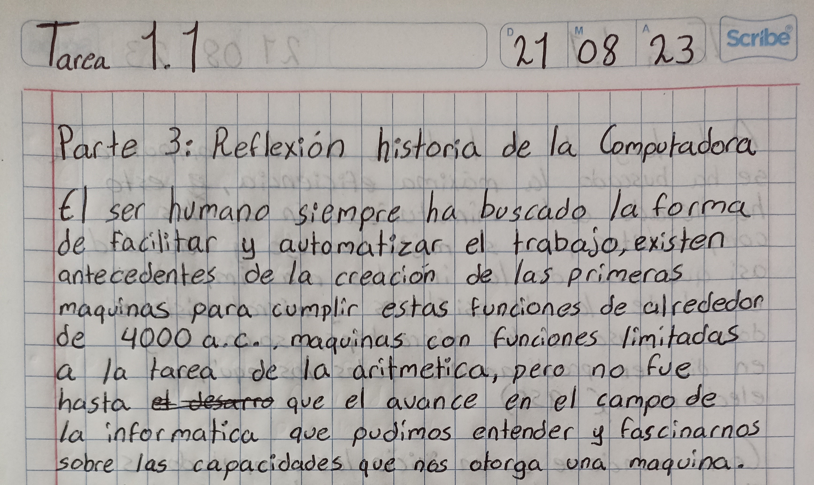

# La computadora y su contexto histórico

----

> La reflexion continua en la siguiente practica

----
| *Alan Turing* | *Tommy Flowers* | *Von Neumann* |
| --------- | --------- | -----: |
|  |  |  |
----

> [*Siguiente*](Practica2.md)

