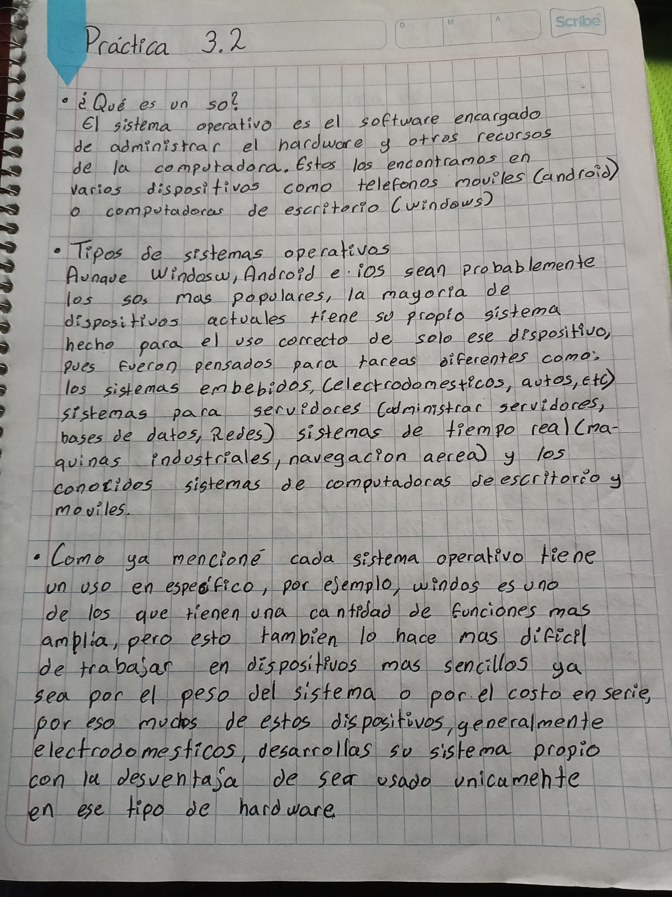

# Instalación de sistemas operativos en un medio extraible

----

#### Investigue qué es un sistema operativo, tipos de sistemas operativos y compárelos en términos de ventajas, desventajas, seguridad, usabilidad y robustez.

----

#### Investigue qué es una imagen ISO y cómo se usa. Descargue el archivo ISO del sistema operativo Linux.

Una imagen ISO es una copia exacta de un medio óptico almacenada en un archivo, y se puede usar de diversas formas, como montarla como una unidad virtual, grabarla en un disco físico, crear una unidad USB booteable o utilizarla en máquinas virtuales. Su versatilidad la hace útil para instalar sistemas operativos, software y realizar tareas de recuperación.

> _Descargue fedora como se ve en la practica [**Instalación de sistemas operativos como máquinas virtuales**](Practica12.md)_
----

#### En una USB con capacidad mayor al archivo ISO que usará (mayor a 4 GiB) instale el programa para crear el USB live que le permitirá arrancar el sistema operativo a instalar

----

#### Investigue los conceptos involucrados: bootear un equipo (guía), BIOS (guía), UEFI (guía), partición (física y lógica, de arranque) (guía), GPT y MBR (guía).

----

#### Haga un video 

----

> [*Siguiente*](Practica12.md)

> [*Anterior*](Practica10.md)
