# Instalación de sistemas operativos como máquinas virtuales

----

#### Investigue qué es la virtualización, una máquina virtual y cómo se instala un sistema operativo en una máquina virtual.

La ***Virtualización*** es una tecnología que permite crear ambientes virtuales o máquinas virtuales (VM, por sus siglas en inglés) que funcionan como sistemas de cómputo independientes dentro de un sistema de cómputo físico. Estas máquinas virtuales son _emulaciones_ de hardware y software que permiten ejecutar múltiples sistemas operativos y aplicaciones en un solo servidor físico.

Una ***máquina virtual*** es una instancia aislada de un sistema operativo y su entorno de aplicaciones que se ejecuta en un entorno virtualizado. Cada VM se comporta como una computadora independiente con su propio sistema operativo y recursos asignados, como CPU, memoria RAM, disco duro y adaptadores de red virtuales.

Pasos para instalar una _máquina virtual_ en Windows
1. Descargar e instalar VirtualBox. [Link](https://www.virtualbox.org/)
2. Descargar una imagen ISO del sistema operativo (por ejemplo, Ubuntu, fedora, Windows)
3. Crear una máquina virtual en VirtualBox 
4. Instalar el sistema operativo

----

#### Instale VirtualBox en su sistema operativo Windows o el que tenga. Luego, instale el sistema operativo Fedora Workstation como una máquina virtual.

- Primero descargamos el ejecutable del VirtualBox

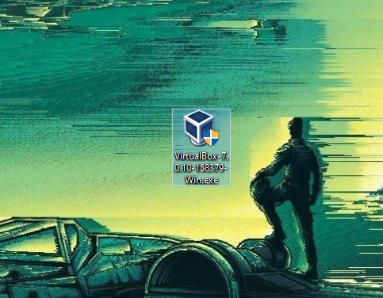

- Lo intalamos

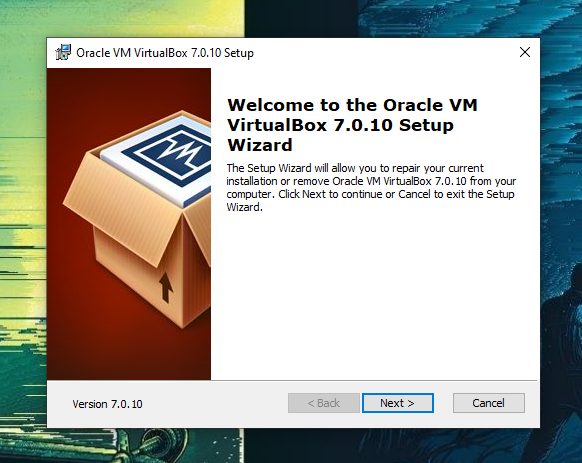

- Una vez intalado

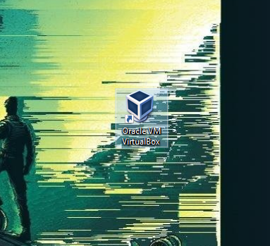

- Lo abrimos

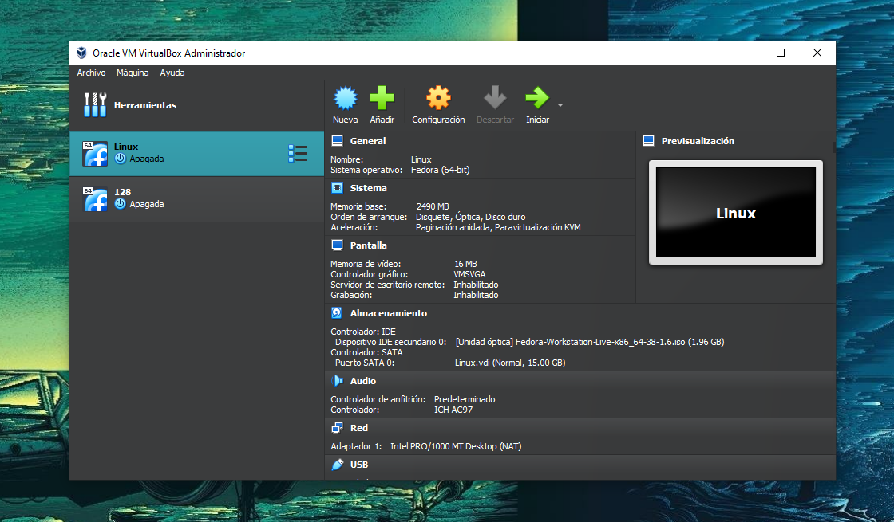

- Ahora creamos una nueva Maquina virtal, aqui elegimos el nombre de nuestra maquina, la carpeta de instalacion y la imagen ISO del SO de nuestra preferencia

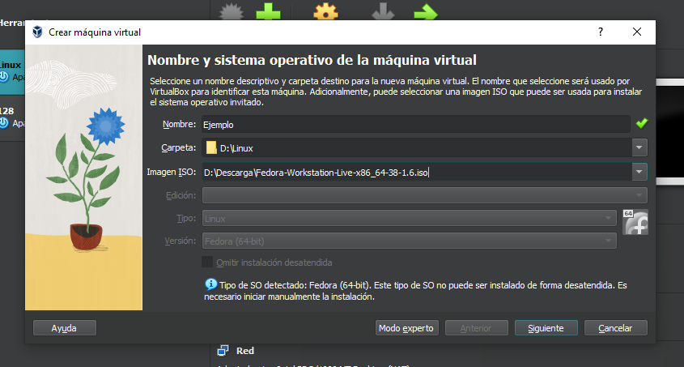

- Yo usare el Fedora Workstation [Link](https://fedoraproject.org/es/workstation/download/)

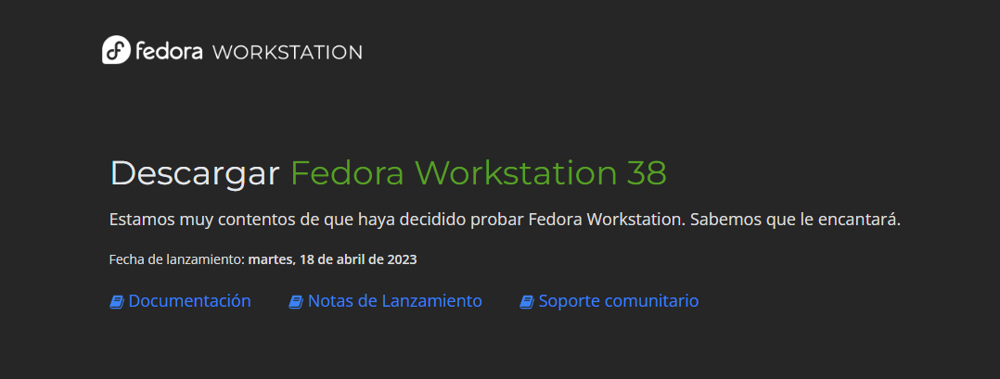

- Asignamos la memoria RAM y los procesadores (No usar toda la del equipo)

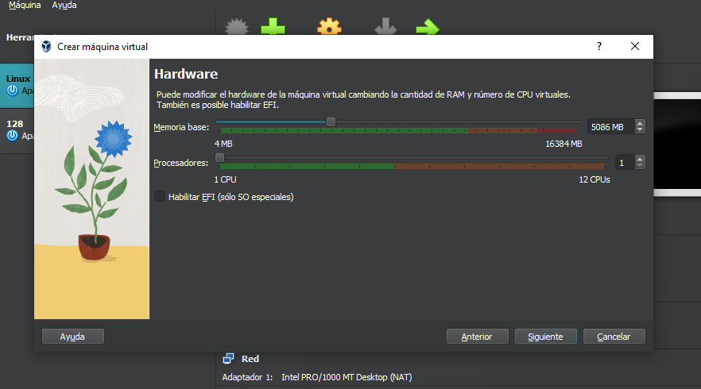

- Asignamos cantidad de disco duro que ocupara nuestra maquina virtual

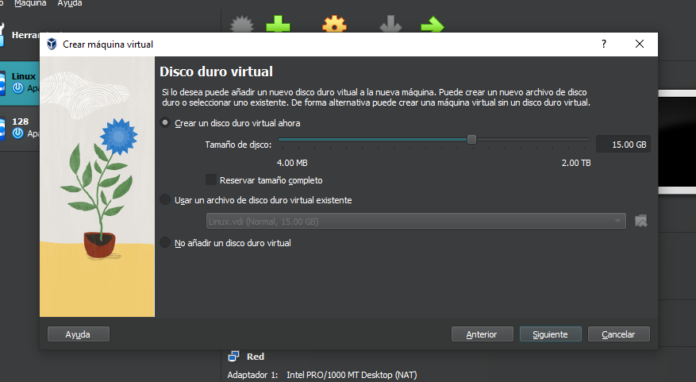

- Y ya esta creada!

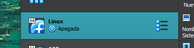

- Ahora solo la iniciamos para probar si funciona bien

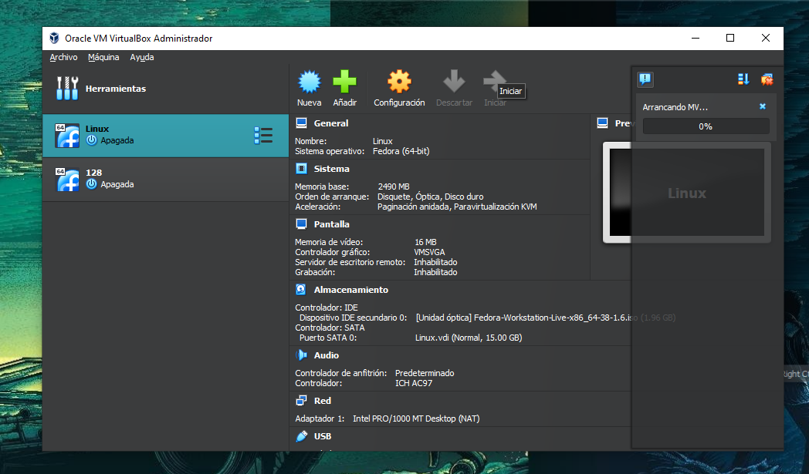
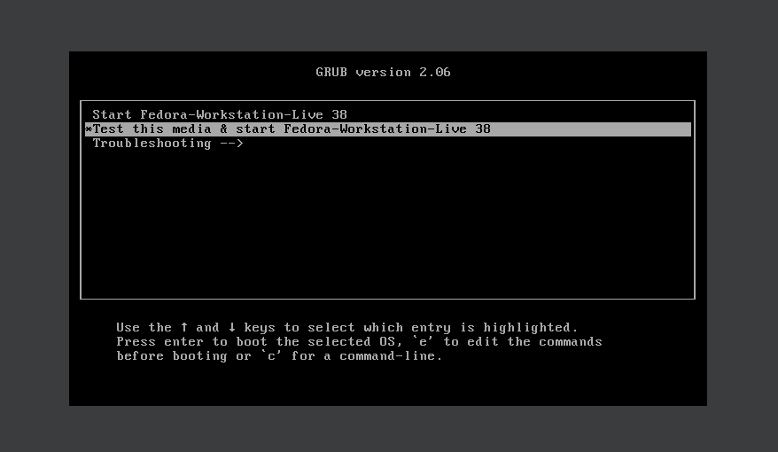

- Y terminamos :D

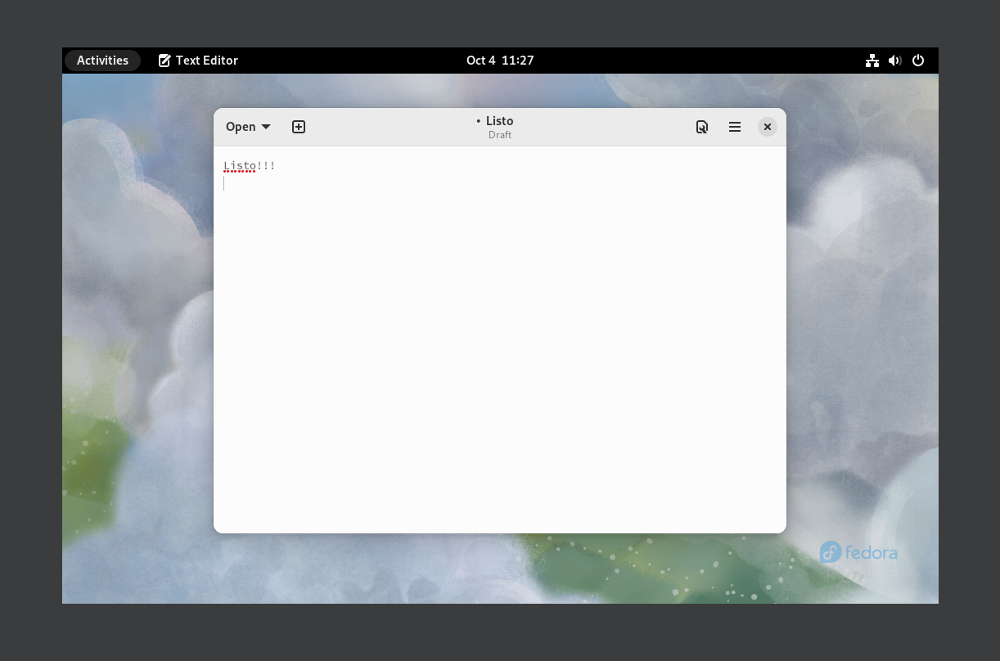

----

#### Haga un video de la práctica

----

> [*Siguiente*](Practica13.md)

> [*Anterior*](Practica11.md)
