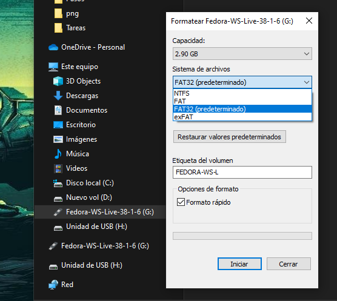
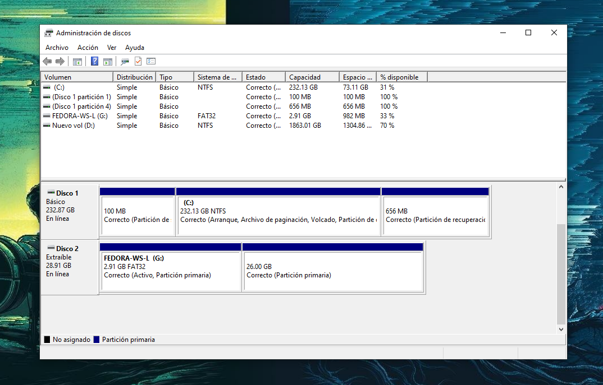
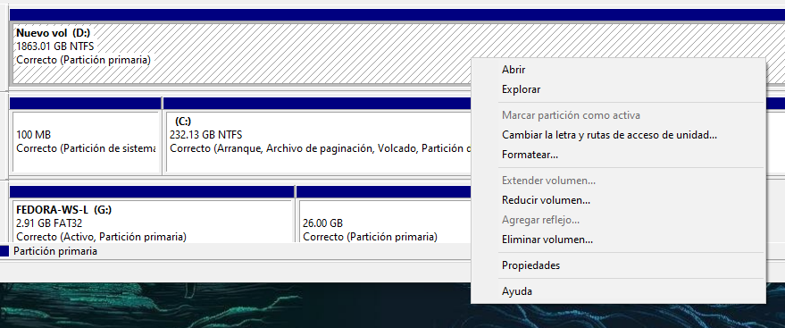

# Particiones y sistemas de archivos

----

#### Investigue los conceptos

1. Partición (física y lógica, primaria, partición de arranque)
- Una partición es una porción lógica de un dispositivo de almacenamiento, como un disco duro, que se trata como una unidad independiente. Las particiones se utilizan para dividir el espacio de almacenamiento en segmentos más pequeños.
- Las particiones primarias son las particiones principales en un disco y pueden contener sistemas de archivos o ser utilizadas para arrancar el sistema operativo.
- Las particiones lógicas son particiones adicionales creadas dentro de una partición extendida y se utilizan para organizar y administrar el espacio en disco de manera más eficiente.
- La partición de arranque es una partición primaria o lógica que contiene los archivos necesarios para iniciar el sistema operativo. En sistemas Windows, esta partición suele llamarse "Partición del Sistema Reservado".
2. GPT y MBR
- GPT (Tabla de particiones GUID) y MBR (Registro maestro de arranque) son dos tipos de esquemas de partición utilizados en dispositivos de almacenamiento.
- MBR es un esquema más antiguo que tiene limitaciones en la cantidad de particiones y el tamaño máximo del disco que puede administrar. Es común en sistemas BIOS.
- GPT es un esquema de partición más moderno que admite discos más grandes y más particiones. Es común en sistemas UEFI y es más flexible y robusto.
3. Formatear un dispositivo de almacenamiento
- Formatear un dispositivo de almacenamiento significa preparar el disco o la partición para su uso al eliminar todos los datos y configuraciones previos. Durante el formateo, se crea un nuevo sistema de archivos en el dispositivo.
- Esto se hace mediante comandos o utilidades del sistema operativo que borran el contenido existente y establecen la estructura necesaria para almacenar datos nuevos.
4. Sistema de archivos
- Un sistema de archivos es una estructura de organización de datos utilizada para almacenar, recuperar y administrar archivos en un dispositivo de almacenamiento. Define cómo se almacenan, nombran, organizan y acceden a los archivos.
- Ejemplos de sistemas de archivos incluyen NTFS (utilizado en Windows), ext4 (utilizado en Linux), FAT32, y más.
5. Archivo
- Un archivo es una unidad de información digital que puede contener datos, texto, programas, imágenes o cualquier otro tipo de información almacenada en una computadora o dispositivo de almacenamiento.
6. Tipos de archivo (binario, texto, programa)
- Archivo binario: Contiene datos que no son legibles directamente como texto y generalmente se utilizan para almacenar información en un formato que no es humano-legible.
- Archivo de texto: Contiene datos en formato de texto legible para humanos, como documentos de texto, código fuente, archivos de configuración, etc.
- Archivo de programa: Contiene instrucciones ejecutables que pueden ser lanzadas como aplicaciones o programas en un sistema informático.
7. Cómo se guarda un archivo
- Los archivos se almacenan en dispositivos de almacenamiento, como discos duros, SSDs, unidades USB, servidores, etc. Se organizan en carpetas y directorios dentro de estos dispositivos según la estructura del sistema de archivos.
8. Las operaciones de manejo de archivos
- Las operaciones de manejo de archivos incluyen crear, abrir, leer, escribir, modificar, mover, copiar, eliminar y renombrar archivos. Estas operaciones permiten a los usuarios y programas gestionar y trabajar con archivos en un sistema de archivos.

----

#### Use una USB sin datos o nueva y practique los procesos de manejo de particiones (crear, cambiar de tamaño, fusionar y eliminar particiones en Windows con Disk Management, de los siguientes tipos: FAT, exFAT, FAT32, NTFS y EXT4. Saque sus conclusiones

Para cambiar el tipo de sistema de archivos podemos formatear la USB (en este caso) y seleccionar el que se adecue

Ahora desde el administrador de discos

Vemos las opciones "*Extender*","*Reducir*","*Agregar*","*Eliminar*" volumen

- Extender volumen:
Esta opción te permite aumentar el tamaño de una partición existente utilizando espacio no asignado contiguo en el mismo disco. Es útil cuando necesitas más espacio en una partición sin eliminar ninguna otra partición.

- Reducir volumen:
La opción "Reducir volumen" te permite disminuir el tamaño de una partición existente y crear espacio no asignado que se puede utilizar para crear nuevas particiones o extender otras particiones.

- Agregar volumen:
Esta opción se usa en Windows Server para agregar espacio no asignado a una partición que ya tiene suficiente espacio asignado. Permite agregar espacio adicional a una partición sin necesidad de redimensionar otras particiones.

- Eliminar volumen:
Al seleccionar "Eliminar volumen", eliminarás completamente la partición seleccionada y todos los datos contenidos en ella se perderán. Esta opción se utiliza para eliminar particiones que ya no son necesarias.

FAT, FAT32, exFAT, NTFS y EXT4 son sistemas de archivos con diferentes características y compatibilidades. La elección del sistema de archivos depende de tus ncesidades y del uso previsto de la unidad USB
La gestión de particiones es una tarea importante que debes realizar con precaución, ya que puede resultar en la pérdida de datos si no se hace correctamente, las particiones se pueden crear, cambiar de tamaño, fusionar y eliminar según sea necesario

----

#### Repita las mismas operaciones de la Parte 3 de esta práctica usando la aplicación GParted Live CD/USB/HD/PXE Bootable Image copiando el archivo ISO en la USB con Ventoy y arrancando el ISO. Utilice este tutorial. Compare Disk Management y gParted y saque sus conclusiones

----

#### Practique la recuperación de particiones eliminadas con TestDisk (tutorial en video, tutorial escrito) en discos o dispositivos de almacenamiento formateados. También, practique la recuperación de dispositivos que no son reconocidos o que piden ser formateados, como una USB (tutorial)

----

#### Haga un video 

----

> [*Siguiente*](Practica14.md)

> [*Anterior*](Practica12.md)
