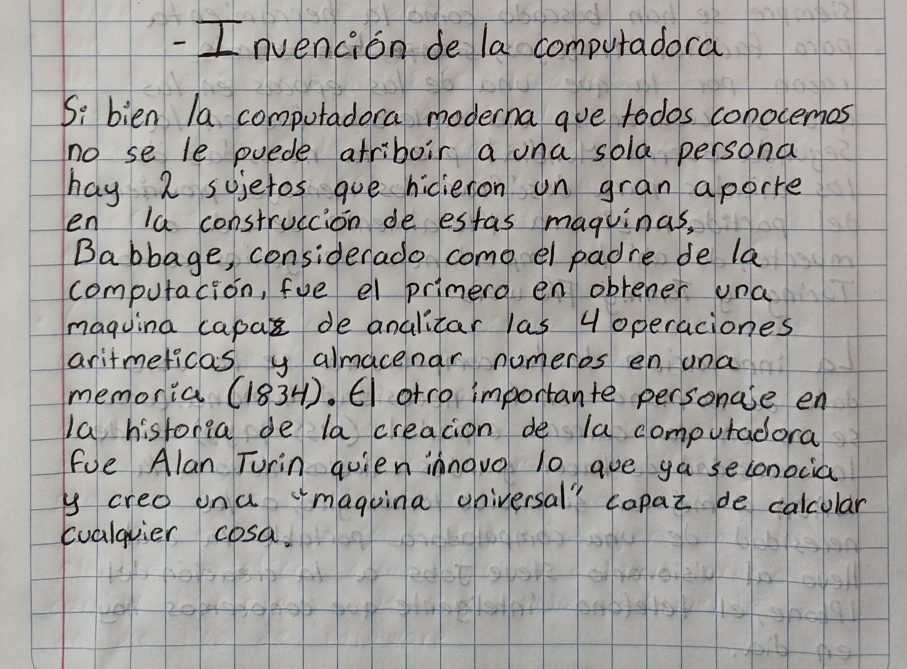

# La disciplina de la computación: contexto histórico, evolución e importancia
----

----

https://github.com/CristianMald/Informatica/assets/142453680/dec2d3ff-bbe9-437d-8fe6-0bd31139e860

----

> [*Siguiente*](Practica3.md)

> [*Anterior*](Practica1.md)
