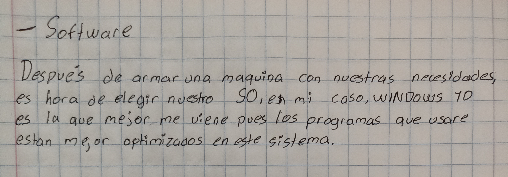

## Adquisición de una computadora

**Parte 2. Ponga un límite presupuestal de acuerdo a sus posibilidades y busque dos equipos nuevos y de segunda mano que cumplan con sus necesidades. Haga un presupuesto de cada componente. Cotice sus equipos en Mercado Libre.**

Mi limite sera 6000$ a partir de este presupuesto vamos a adaptar una Pc que cumpla con mis necesidades.
Primero voy a enlistar mis necesidades:

----
| Componente      | Nombre | Valor |
| --------- | --------- | -----:|
| RAM | 8gb DDR4 (o mas) | 378$ |
| ALMACENAMIENTO | 250gb (o mas) | 427$ |
| PROCESADOR | AMD ryzen 3 (o superior) | 2048$ |
| SISTEMA OPERATIVO | WINDOWS 10 | 300$ |
| MOTHERBOARD | Asus prime A320MK | 1069$ |
| FUENTE DE ALIMENTACION | 500W | 1139$ |
| GABINETE | (el necesario) | 800$ |                
----
#### TOTAL = 6161$ (Tener en cuenta fechas, ofertas, otros sitios, etc)

Según esta lista podemos encontrar en ML estas opciones:

[Esta es una gran opción ya que tiene lo que necesito y con cosas extra como mas RAM, tarjeta WIFI, ya esta ensamblada y es un poco mas barata que la que yo arme (5990$)](https://articulo.mercadolibre.com.mx/MLM-1698896663-pc-gamer-ryzen-5600g-16gb-ram-500-ssd-graficos-radeon-7-wifi-_JM#position=3&search_layout=stack&type=item&tracking_id=537487e5-b097-4a2f-b17e-b51c8c0d72ac)

De segunda mano encontramos: 

[Esta es muy similar y se adecua a nuestras necesidades, a parte es mucho mas barata que la que armamos (4200$)](https://articulo.mercadolibre.com.mx/MLM-1465047369-computadora-gamer-basica-completa-8gb-de-ram-y-500-gb-_JM#position=4&search_layout=stack&type=item&tracking_id=05fbaa99-c5a3-451c-94a3-6b2e5f2a89d1)
                
