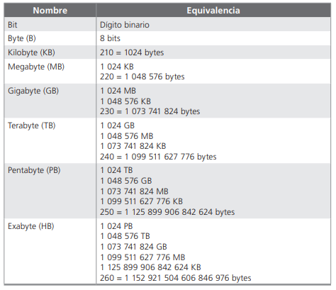

# Conceptos básicos de software

----

#### En equipo, investigue la definición formal de los conceptos básicos de software

- ***BIT:***
*Es la mínima pulsación electrónica que recibe una computadora (bit, binary digit: dígito
binario); es decir, es la mínima cantidad de información (datos) que recibe una computadora y puede ser ya sea 0 o 1 y representa el estado de un dispositivo que puede tomar uno
de dos estados. Un foco puede estar apagado o encendido. El significado o representación
es la siguiente: 1 = encendido y 0 = apagado. Un interruptor electrónico puede representar
un bit. Actualmente las computadoras utilizan varios dispositivos binarios de dos estados
para almacenar datos*

- ***byte y unidades derivadas:***
*Es la agrupación de 8 bits, un patrón con una longitud de 8 bits se llama byte. Este término también se ha utilizado para medir el tamaño de la memoria o de otros dispositivos
de almacenamiento y se abrevia con la letra “B”. La memoria de una computadora que
puede almacenar 8 millones de bits de información es una memoria de 1 millón de bytes*

*En la tabla siguiente se muestran los múltiplos de los bytes los cuales nos facilitarán
hacer referencia a una gran cantidad de bytes contenidos en un archivo o dispositivo de almacenamiento, así como también para cuantificar la capacidad de almacenamiento en la
memoria principal*

> [Tabla sacada de "Fundamentos de Computación para Ingenieros"](https://libgen.rs/book/index.php?md5=93B1B3A032FA25F502EB136C35C52596)

- ***dato:***
*Se refiere a una representación simbólica o numérica de información. Los datos pueden ser cualquier tipo de información que se almacena y procesa en una computadora, como números
texto, imágenes, sonidos, etc. Los datos son la materia prima que se utiliza en la
informática para realizar operaciones, tomar decisiones y generar resultados*

- ***tipos de datos:***

- ***dato numérico:***
*Los programas utilizados en arquitectura o en ingeniería que procesa una computadora
son de tipo numérico, aritmético, algebraico o trigonométrico; por ejemplo, es posible la
resolución de raíces en una ecuación*

- ***dato alfanumérico (caracter o texto):***
*En este tipo de datos se utilizan programas de procesamiento de palabras o texto, que nos
permiten corregir, borrar, justificar, mover, eliminar párrafos completos o sólo parte de
ellos, corregir ortografía, etcétera*

- ***archivo:***

- ***sistemas numéricos e información:***

----

#### Haga un mapa conceptual para organizar los conceptos en una jerarquía, hasta lograr la mejor claridad posible y páselo en limpio con ayuda de la herramienta CmapTools

----

> [*Siguiente*](Practica4.md)

> [*Anterior*](Practica2.md)
