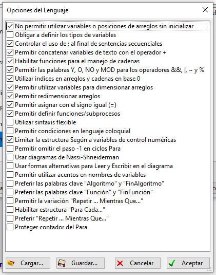

# Pseudocódigo

----

Estudie, a discreción, el curso de PSeInt y la guía de PSeInt con ejemplos y pruebe algunos ejemplos. Si lo prefiere, estudie el sistema de información para la operación de un estacionamiento en PSeInt. Descargue el archivo con el código fuente del pseudocódigo, disponible en la descripción de cada uno de ellos y observe el crecimiento progresivo de la aplicación.
#### Distinga entre el proceso principal y los subprocesos. Para cada subproceso identifique los parámetros o datos de entrada, el pase valores (por valor y por referencia) y el valor de regreso.

```
//Este es el codigo para la administracion de un estacionamiento, por el momento solo es la primera parte pero nos sirve para localizar lo solicitado

Proceso Parqueadero
	
	//Definición de variables
	Definir  CANTIDADPUESTOS, opciong, ingresado como entero; 
	Definir  valorMinuto Como Real;
	CANTIDADPUESTOS=10;
	
	//Definición de vectores
	dimension placa[CANTIDADPUESTOS];
	dimension puesto[CANTIDADPUESTOS];
	dimension horaIngreso[CANTIDADPUESTOS];
	dimension horaSalida[CANTIDADPUESTOS];
	dimension propietario[CANTIDADPUESTOS];
	dimension ocupados[CANTIDADPUESTOS];
	
	//Inicializar variables con un valor en especifico
	opciong=0 ;
	valorMinuto=300;
	ingresado=0;
	
	//este es proceso principal del codigo, por el momento sirve para pedir que quiere hacer el cliente y se repite hasta llegar a la opcion final
	Para i=0 Hasta CANTIDADPUESTOS-1 Con Paso 1 Hacer
		puesto[i]="A"+ConvertirATexto(i);
		ocupados[i]=-1;
	FinPara
	
	Escribir "                ###############################";
	Escribir "                # Paqueadero MaxTechnology 24/7 #";
	Escribir "                ###############################";
	Escribir "";
	
	
	Repetir
		Escribir "-------------------------------";
		Escribir "| 1. Ingresar vehiculo        |";
		Escribir "| 2. Dar salida a un vehiculo |";
		Escribir "| 3. Consultar disponibilidad |";
		Escribir "| 4. Puestos asignados        |";
		Escribir "| 5. Salir                    |";
		Escribir "-------------------------------";
		Escribir "";
		leer opciong;

    //estos son los subprocesos, al ingresar alguno de estos numeros (opciones) en la pantalla de ejecucion del codigo, llevara a una de estas 5 opciones
    //al ser una opcion multiple, cuenta como "datos de entrada"
    //cada "Escribir" da un valor de regreso diferente dependiendo la opcion
		Segun opciong Hacer
			1:
				Escribir "Ingresar vehiculo";
			2:
				Escribir "Dar salida";
			3:
				Escribir "Disponibilidad";
			4:
				Escribir "Ocupados...";
			5:
				Borrar Pantalla;
				Escribir "Chao.";
			De Otro Modo:
				Escribir  "Opción no valida";
		FinSegun
		
	Hasta Que opciong=5
	
FinProceso

```
Importante tener estas opciones:



----

Documente en un video de hasta 10 minutos su experiencia en la realización de la actividad y comparta el video en el grupo de Telegram. Suba los archivos creados o modificados a su cuenta de Google Drive donde corresponda

----

> [*Siguiente*](Practica8.md)

> [*Anterior*](Practica6.md)
