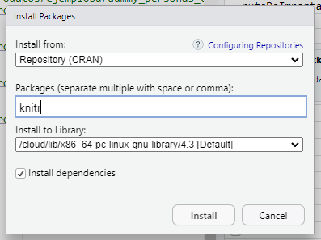
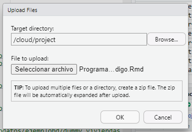

# De pseudocódigo a R

----

#### En equipo, active su cuenta para usar RStudio en la nube. Cree un proyecto llamado Informatica. Aprenda lo básico de la ejecución de código R en un script. Luego, instale por lo menos dos entornos gráficos para R, adicionales a RStudio, de esta lista. Abra el proyecto creado en la Parte 1. Instale el módulo rio. Suba el script para la importación, exportación y conversión de archivos. Adapte y ejecute el script para que funcione correctamente.


> Este es el link de mi perfil en donde realize la practica en PisitCloud [LINK](https://posit.cloud/content/6552430)

> ***Es necesario el correo electronico para compartir con la opcion "Share Link"***

----

#### Luego, repase este tutorial de RMarkdown. Suba el archivo Programacion-en-Pseudocodigo.Rmd al directorio respectivo del proyecto. Abra el archivo y compílelo con knitr para generar el archivo HTML. Ahora estúdielo como repaso de PSeInt

- Primero intale el packete **Knitr**
 
 
- Despues subi el archivo "Programacion-en-Pseudocodigo.Rmd"
 
 
- Para convertir el archivo a HTML, use el codigo:
 
 
- Y me creo el archivo final
 

----

#### Pruebe sus conocimientos implantando en un par de funciones en R, los algoritmos que implantó en PseInt en la Práctica 2.4. en un archivo RMarkdown, exponiendo en primer lugar el pseudocódigo y luego el código en R

```

----------------
  
  # Algoritmo en Pseint

----------------
  
#Proceso Adivinar
#Definir x,n,intentos Como Entero;
#
#x= Aleatorio(1,100);
#intentos=0;
#
#Escribir "?Bienvenido al juego de adivina el n?mero!";
#Escribir "Estoy pensando en un n?mero entre 1 y 100. ?Adivina cu?l es!";
#
#Repetir
#
#intentos= intentos +1;
#Escribir "Intento ", intentos, ": Ingresa tu n?mero: ";
#Leer n;
#Si n = x Entonces
#Escribir "?Correcto! Has adivinado el n?mero en ", intentos, " intentos.";
#SiNo 
#si n < x Entonces
#si x-n < 10 Entonces
#Escribir "Demasiado peque?o, pero la diferencia es menor a 10. ?Int?ntalo de nuevo!";
#SiNo
#Escribir "Demasiado peque?o. Intenta de nuevo.";
#FinSi
#SiNo
#si n-x < 10 Entonces
#Escribir "Demasiado grande, pero la diferencia es menor a 10. ?Int?ntalo de nuevo!";
#SiNo
#Escribir "Demasiado grande. Intenta de nuevo.";
#FinSi
#FinSi
#FinSi	
#
#HASTA QUE n=x
#
#
#FinProceso

----------------
  
  # Algoritmo en R
  
----------------
  
# Cargar la función de generación de números aleatorios
set.seed(123)

x <- sample(1:100, 1)

intentos <- 0

cat("¡Bienvenido al juego de adivinar el número!\n")
cat("Estoy pensando en un número entre 1 y 100. ¿Adivina cuál es!\n")

repeat {
  intentos <- intentos + 1
  cat("Intento", intentos, ": Ingresa tu número: ")
  n <- as.integer(readline())
  if (n == x) {
    cat("¡Correcto! Has adivinado el número en", intentos, "intentos.\n")
    break  # Salir del bucle si se adivinó el número
  } else {
    diferencia <- abs(x - n)
    if (diferencia < 10) {
      cat("Demasiado", ifelse(n < x, "pequeño", "grande"), ", pero la diferencia es menor a 10. ¡Inténtalo de nuevo!\n")
    } else {
      cat("Demasiado", ifelse(n < x, "pequeño", "grande"), ". ¡Intenta de nuevo!\n")
    }
  }
}

```

----

#### Haga un video de la práctica de las partes 1 a 3 y R y reflexione sobre el potencial que tiene esta tecnología a modo de tutorial y súbalo a su Google Drive

----

> [*Siguiente*](Practica10.md)

> [*Anterior*](Practica8.md)
