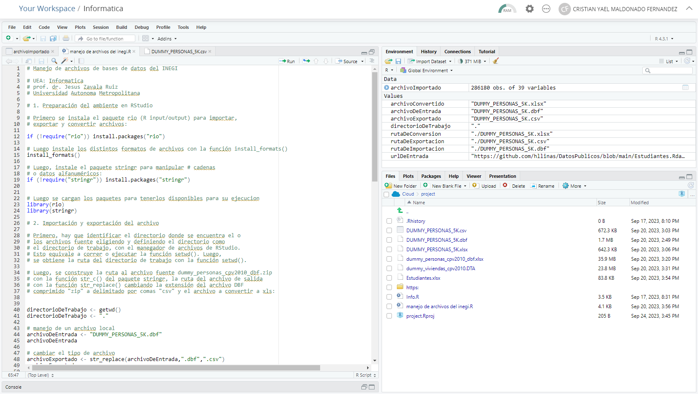

# De pseudocódigo a R

----

#### En equipo, active su cuenta para usar RStudio en la nube. Cree un proyecto llamado Informatica. Aprenda lo básico de la ejecución de código R en un script. Luego, instale por lo menos dos entornos gráficos para R, adicionales a RStudio, de esta lista. Abra el proyecto creado en la Parte 1. Instale el módulo rio. Suba el script para la importación, exportación y conversión de archivos. Adapte y ejecute el script para que funcione correctamente.

> Este es el link de mi perfil en donde realize la practica en PisitCloud [LINK](https://posit.cloud/content/6552430)

> ***Es necesario el correo electronico para compartir con la opcion "Share Link"***

----

#### Luego, repase este tutorial de RMarkdown. Suba el archivo Programacion-en-Pseudocodigo.Rmd al directorio respectivo del proyecto. Abra el archivo y compílelo con knitr para generar el archivo HTML. Ahora estúdielo como repaso de PSeInt

----

#### Tome como base el tutorial Programacion-en-Pseudocodigo.Rmd e identifique las instrucciones equivalentes en R que encuentre en el tutorial de R. En el directorio respectivo del proyecto, cree un archivo RMarkdown que sea la síntesis 1 a 1 del tutorial Programacion en Pseudocodigo. Compílelo con knitr para generar el archivo HTML. El archivo RMarkdown es su entregable

----

#### Pruebe sus conocimientos implantando en un par de funciones en R, los algoritmos que implantó en PseInt en la Práctica 2.4. en un archivo RMarkdown, exponiendo en primer lugar el pseudocódigo y luego el código en R

----

#### Haga un video de la práctica de las partes 1 a 3 y R y reflexione sobre el potencial que tiene esta tecnología a modo de tutorial y súbalo a su Google Drive

----

> [*Siguiente*](Practica10.md)

> [*Anterior*](Practica8.md)
